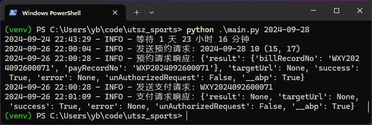
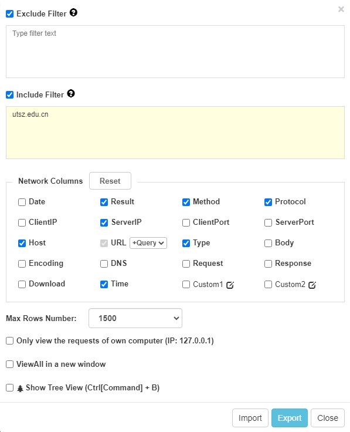
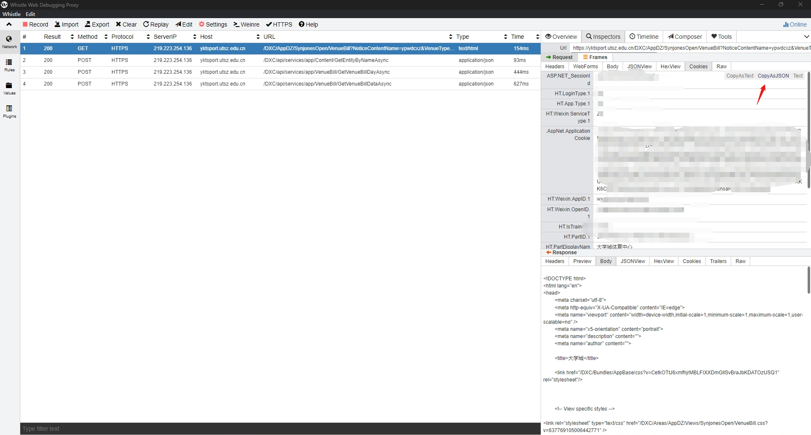

# UTSZ sports ordering scripts

订场需要定时操作，有点繁琐，所以写了个脚本。

**场地资源仍然是有限的，脚本仅应用于替代本就存在的人工操作。**

- 本脚本基于`python 3.12.6`开发，不保证向下兼容。

脚本会等待至目标日期前2天的22:00:03开始订场。对于已经发布的场次，脚本会立即订场。

## 使用方法

- 获取微信cookies，保存到`data/cookies.json`。
- 使用pip安装python依赖：`pip install -r requirements.txt`。
- 运行脚本：`python main.py 2024-09-30 10 15 17`。（订2024年9月30日的10号15点-17点场地）

### 获取cookies

Cookies用于绑定用户身份。获取Cookies需要抓包微信HTTPS流量。
data/cookies_example.json中给出了一个示例。
目前为止没有遇到Cookies过期，应当长期有效。

这里给出使用Whistle抓包Windows端微信请求的方法：
1. 安装[Whistle](https://github.com/avwo/whistle-client/releases)。
2. 安装RootCA（whistle->install Root CA）。
3. 设置白名单过滤`utsz.edu.cn`（Settings）：

4. 开启系统代理（Whistle->Set As System Proxy）（建议关闭其他代理软件）。
5. 在微信中访问体育中心页面。
6. 选择任意请求，查看Cookies并复制：

7. 将Cookies保存到`data/cookies.json`，删去`XSRF-TOKEN`项和两个`DisplayName`项。
8. 发送请求时请关闭代理，否则会遇到SSL证书错误警告。
